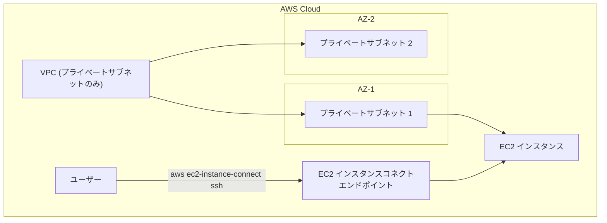

# VPC with Private Subnet and EC2 Instance Connect

このCDKプロジェクトでは、以下のリソースを作成します：

1. プライベートサブネットのみを持つVPC（2つのAZ）
2. プライベートサブネット内のEC2インスタンス
3. EC2インスタンスコネクトエンドポイント（インスタンスへの接続用）

## デプロイ方法

```bash
# 依存関係のインストール
npm install

# TypeScriptのコンパイル
npm run build

# CDKのデプロイ
npx cdk deploy
```

## EC2インスタンスへの接続方法

デプロイ後、以下のコマンドでEC2インスタンスに接続できます：

```bash
# EC2インスタンスコネクトを使用して接続
# インスタンスIDとエンドポイントIDは修正
aws ec2-instance-connect ssh \
    --instance-id i-0b2f3babc36e404f0 \
    --eice-options maxTunnelDuration=3600,endpointId=eice-051663bd11e9bd9ee \
    --os-user ec2-user 
```

## アーキテクチャの特徴

- **セキュリティ**: インターネットからの直接アクセスができないプライベートサブネットにEC2インスタンスを配置
- **接続性**: EC2インスタンスコネクトエンドポイントを使用して、インターネットゲートウェイやNATゲートウェイなしでもインスタンスに安全に接続可能
- **コスト効率**: NATゲートウェイを使用しないため、コストを削減

## アーキテクチャ構成図


