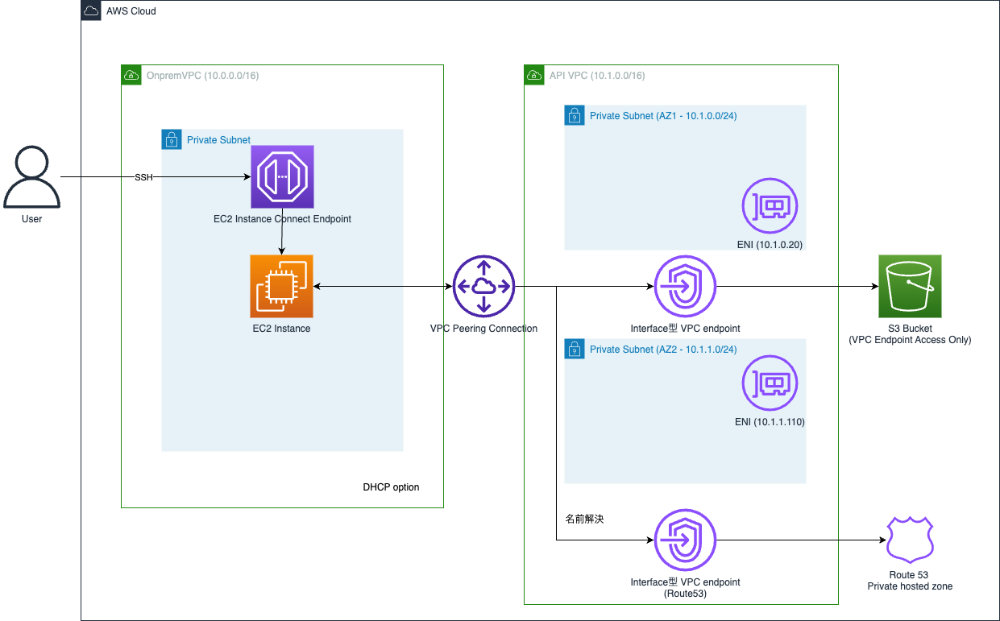

# S3Arc - VPC with Private Subnet, EC2 Instance Connect, S3 and Transcribe VPC Endpoints

このCDKプロジェクトでは、以下のリソースを作成します：

1. プライベートサブネットのみを持つ2つのVPC：
   - OnpremVPC：Windows Serverインスタンスを含む（1つのAZ）
   - API VPC：将来のAPIリソース用（2つのAZ）
2. OnpremVPCとAPI VPC間のVPCピアリング接続
3. OnpremVPC内のプライベートサブネットにWindows Serverインスタンス
4. EC2インスタンスコネクトエンドポイント（インスタンスへのRDP接続用）
5. API VPC内のS3インターフェースVPCエンドポイント
6. API VPC内のTranscribeインターフェースVPCエンドポイント
7. VPCエンドポイント経由でのみアクセス可能なS3バケット（1日後に自動削除）
8. DNS通信用のセキュリティグループ

## アーキテクチャ構成図



## デプロイ方法

```bash
# 依存関係のインストール
npm install

# TypeScriptのコンパイルとデプロイ
npm run cdk:deploy
```

または、ホットスワップデプロイを使用する場合：

```bash
npm run cdk:deploy:hotswap
```

## デプロイ後に必要な手作業
- S3 VPC EPのPrivate DNSを有効化する
- Route 53インバウンドエンドポイントをAPI VPCに設定
- Peeringごとのルートテーブルの設定
- DHCPオプションセットを作成
- OnpremVPC のDHCPオプションを作成したものに変更

## Windows Serverインスタンスへの接続方法

デプロイ後、以下の手順でWindows Serverインスタンスに接続できます：

### 1. キーペアの取得

デプロイ後、キーペアがCDKによって作成されます。AWS Management ConsoleまたはAWS CLIを使用してキーペアをダウンロードします。

### 2. Windowsパスワードの取得

```bash
# CDK出力からインスタンスIDを取得
INSTANCE_ID=<出力から取得したインスタンスID>

# Windowsパスワードを取得
aws ec2 get-password-data --instance-id $INSTANCE_ID --priv-launch-key /path/to/downloaded/<キーペア名>.pem
```

### 3. RDPトンネルの確立

```bash
# CDK出力からインスタンスIDとエンドポイントIDを取得
INSTANCE_ID=<出力から取得したインスタンスID>

# EC2インスタンスコネクトを使用してRDPトンネルを確立
aws ec2-instance-connect open-tunnel \
    --instance-id $INSTANCE_ID \
    --remote-port 3389 \
    --local-port 13389
```

### 4. RDPクライアントで接続

ローカルのRDPクライアントを起動し、以下の情報で接続します：
- ホスト: localhost:13389
- ユーザー名: Administrator
- パスワード: 手順2で取得したパスワード

## S3バケットへのアクセス

S3バケットには、API VPC内のS3インターフェースVPCエンドポイント経由でのみアクセスできます。
バケットポリシーにより、指定されたVPCエンドポイントからのアクセスのみが許可されています。

PowerShell を開いて、検証
```powershell
nslookup s3.ap-northeast-1.amazonaws.com

# サーバー:  ip-10-1-1-79.ap-northeast-1.compute.internal
# Address:  10.1.1.79

# 権限のない回答:
# 名前:    s3.ap-northeast-1.amazonaws.com
# Addresses:  10.1.1.134
#           10.1.0.162
```

## 文字起こしの開始方法
[transcribe.ps1](./packages/cdk/lib/transcribe.ps1) の実行コマンドは以下になる。
```powershell
powershell .\transcribe.ps1 `
    -AWS_ACCESS_KEY_ID <アクセスキー> `
    -AWS_SECRET_ACCESS_KEY <シークレットキー> `
    -REGION ap-northeast-1 `
    -FILE_PATH <ローカルの音声ファイルのパス>
```

実行の流れは以下の通りである。


## アーキテクチャの特徴

- **セキュリティ**: インターネットからの直接アクセスができないプライベートサブネットにWindows Serverインスタンスを配置
- **接続性**: EC2インスタンスコネクトエンドポイントを使用して、インターネットゲートウェイやNATゲートウェイなしでもインスタンスに安全にRDP接続可能
- **VPCピアリング**: OnpremVPCとAPI VPC間の通信を可能にする
- **S3プライベートアクセス**: VPCエンドポイント経由でのみS3バケットにアクセス可能
- **コスト効率**: NATゲートウェイを使用しないため、コストを削減
- **モジュール性**: コンストラクトを使用して、コードの再利用性と保守性を向上
