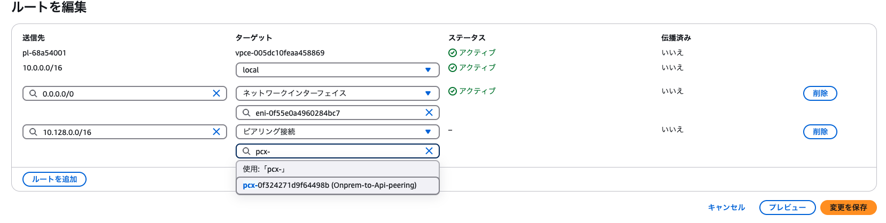

# s3asr w/ Dify on AWS with CDK


> [!IMPORTANT]
> `debugMode: false` の場合、API VPC のリソースのみ作成されます。
> `difySetup: true` の場合のみ、NAT インスタンスが作成されます。

> [!WARNING]
> オンプレミスと接続する場合は、別途 Site-to-Site VPN などの設定をご自身で行なっていただく必要がございます。

## 前提条件
- [Node.js](https://nodejs.org/en/download/) (v18 or newer)
- [AWS CLI](https://docs.aws.amazon.com/cli/latest/userguide/getting-started-install.html) and IAM profile with Administrator policy

## 準備
リポジトリのクローン。

```bash
# 本リポジトリのみクローン
git clone https://github.com/aws-samples/dify-self-hosted-on-aws.git

# もしくは
# Dify on AWS with CDK　のリポジトリも含めてクローン
git clone --recurse-submodules https://github.com/aws-samples/dify-self-hosted-on-aws.git
```
## デプロイ方法

このCDKプロジェクトでは、[packages/bin/app.ts](./packages/cdk/bin/app.ts) のパラメータ設定により、立ち上げるリソースを変更することができます。詳しくは[設定](#設定)を確認ください。

設定完了後、以下のコマンドでデプロイします。

```bash
# 依存関係のインストール
npm ci

# TypeScriptのコンパイルとデプロイ
npm run cdk:deploy
```

デプロイが完了すると、[packages/cdk/output.json](packages/cdk/output.json) にデプロイの出力パラメータが保存されます。`ApiVpcApiVpcID**` のようなキーを持つパラメーターは、VPC ID (e.g. `vpc-xxxxxxx`) が記載され、Dify のデプロイ時に利用します。

デプロイ完了後、[Dify on AWS with CDK](https://github.com/aws-samples/dify-self-hosted-on-aws) を [Dify のセットアップとデプロイ](#dify-のセットアップとデプロイ)に従ってデプロイします。

### 設定
[packages/cdk/bin/app.ts](packages/cdk/bin/app.ts) を編集します。この設定により、デプロイされるリソースやその設定が決定します。
```ts
export const props: EnvironmentProps = {
  awsRegion: "ap-northeast-1", // s3asr の構築リージョン
  awsAccount: process.env.CDK_DEFAULT_ACCOUNT!,
  bucketName: "s3-asr-bucket", // 音声書き起こし用の S3 Bucket
  apiVpcCidr: "10.0.0.0/16", // 作成する API　VPC の CIDR
  onpremiseCidr: "10.128.0.0/16", // オンプレの CIDR

  // true if you are deploying and/or setting up a dify package for the first time
  difySetup: true,

  // for debug
  debugMode: true,
};
```

#### debugMode: `false` の場合：

1. API VPC (Multi-AZ)：
   - プライベートサブネット: Dify　のリソースと Amazon Transcribe, AMazon S3　の VPC エンドポイントが立ちます。
   - パブリックサブネット: Dify 初回セットアップ用
2. S3インターフェースVPCエンドポイント
3. VPCエンドポイント経由でのみアクセス可能なS3バケット（オブジェクトは1日後に自動削除）
4. API VPC内のTranscribeインターフェースVPCエンドポイント
5. Dify セットアップ用のNATインスタンス (`difySetup: true` の場合)
   - セットアップ完了後に `false` にすることでNATインスタンスを消去可能
6. DNS通信用のセキュリティグループ

#### debugMode: `true` の場合：

上記に追加で、以下が立ち上がります。
1. プライベートサブネットのみを持つ2つのVPC：
   - OnpremVPC：Windows Serverインスタンスを含む（1つのAZ）
   - API VPC：将来のAPIリソース用（2つのAZ）
2. OnpremVPCとAPI VPC間のVPCピアリング接続
3. OnpremVPC内のプライベートサブネットにWindows Serverインスタンス
4. EC2インスタンスコネクトエンドポイント（インスタンスへのRDP接続用）

このモードではデプロイ後に以下を行う必要があります。以下のセットアップをマネジメントコンソール上で行うことにより、検証用 EC2 (Windows Server) から S3 や Transcribe、Dify への VPC を跨いだ通信ができるようになります。

1. Peeringごとのルートテーブルの設定
    - OnpremVPC のルートテーブル 1 つ編集 (s3asr-Onprem-private-subnet-1)
     
    - API VPC のルートテーブル 2 つ編集 (s3asr-Api-private-subnet-{1,2})
    
2. DHCPオプションセットを作成
    - CDKで作成されたRoute 53 インバウンドエンドポイントのIPを新規のDHCPオプションを作成時、ドメインネームサーバーの部分に登録
    
3. OnpremVPC の DHCP オプションを作成したものに変更
    - 「VPC > VPCの設定を編集」からDHCP設定を変更
    

### Dify のセットアップとデプロイ
[Dify on AWS with CDK](https://github.com/aws-samples/dify-self-hosted-on-aws) リポジトリをご自身、もしくは[準備](#準備)手順に従いクローンしておきます。

以下のように、[dify-self-hosted-on-aws/bin/cdk.ts](dify-self-hosted-on-aws/bin/cdk.ts)のパラメータを設定します。

```ts
// 上略
export const props: EnvironmentProps = {
  // s3asr プロジェクトをデプロイしたのと同じリージョンに変更
  awsRegion: 'ap-northeast-1',
  awsAccount: process.env.CDK_DEFAULT_ACCOUNT!,
  // Set Dify version
  difyImageTag: '1.1.3',
  // Set plugin-daemon version to stable release
  difyPluginDaemonImageTag: '0.0.6-local',

  // uncomment the below options for less expensive configuration:
  // isRedisMultiAz: false,
  // useNatInstance: true,
  // enableAuroraScalesToZero: true,
  // useFargateSpot: true,

  // 以下を追記します。
  useCloudFront: false,
  internalAlb: true,
  vpcId: "vpc-xxxxxxx" // packages/cdk/output.json に記載の VPC　ID の値
};

const app = new cdk.App();

// 以下略
```

また、[dify-self-hosted-on-aws/lib/constructs/alb.ts](dify-self-hosted-on-aws/lib/constructs/alb.ts) を以下のように変更します。

```ts
// 上略
    const alb = new ApplicationLoadBalancer(this, 'Resource', {
      vpc,
      vpcSubnets: vpc.selectSubnets({
        subnets: internal ? vpc.privateSubnets.concat(vpc.isolatedSubnets) : vpc.publicSubnets,
      }),
      internetFacing: !internal,
      idleTimeout: Duration.seconds(3000),　// ここを追記
    });
// 以下略
```

編集完了後、ディレクトリを移動して、以下のコマンドでデプロイを開始します。

```sh
pushd dify-self-hosted-on-aws/
npm ci
npx cdk deploy --all
popd
```

詳しい閉域 Dify のデプロイ方法は、[dify-self-hosted-on-aws #Deploying to a closed network (a.k.a 閉域要件)](https://github.com/aws-samples/dify-self-hosted-on-aws?tab=readme-ov-file#deploying-to-a-closed-network-aka-%E9%96%89%E5%9F%9F%E8%A6%81%E4%BB%B6) をご確認ください。

## 文字起こしの開始方法
事前に、以下の権限を持つ [IAM ユーザーを作成](https://us-east-1.console.aws.amazon.com/iam/home?region=us-west-2#/users)し、シークレット情報を控えておく必要があります。
- AmazonS3FullAccess
- AmazonTranscribeFullAccess
### Windows (PowerShell)
[transcribe.ps1](./packages/cdk/lib/transcribe.ps1) の実行コマンドは以下になる。
```powershell
powershell .\transcribe.ps1 `
    -AWS_ACCESS_KEY_ID <アクセスキー> `
    -AWS_SECRET_ACCESS_KEY <シークレットキー> `
    -REGION ap-northeast-1 `
    -FILE_PATH <ローカルの音声ファイルのパス>
```

### Linux (シェルスクリプト)
[transcribe.sh](./packages/cdk/lib/transcribe.sh) の実行コマンドは以下になる。
```bash
sh ./transcribe.sh \
    --aws-access-key-id <key> \
    --aws-secret-access-key <secret> \
    --region <region> \
    --file-path <path>
```

実行の流れは以下の通りである。


## デバッグモード
以降の手順は、`debugMode: true` の場合の、検証方法です。

### Windows Serverインスタンスへの接続方法

デプロイ後、以下の手順で Windows Server インスタンスに接続できます：

1. キーペアの取得
    ```bash
    npm run debug:get-pem
    ```

2. Windowsパスワードの取得
    ```bash
    # CDK出力に表示されるコマンドを実行（例）
    npm run debug:pw
    ```

3. RDPトンネルの確立
    ```bash
    # CDK出力に表示されるコマンドを実行（例）
    npm run debug:rdp
    ```

### 4. RDPクライアントで接続

EC2 は完全閉域にデプロイされるため、インターネットへ接続できません。そのため、事前にローカルへ AWS CLI v2 ダウンロードしておき、ローカルのフォルダをリモート先にマウントし、参照できるようにします。これにより、インターネットに接続できない EC2 に[AWS CLI v2 for Windows の msi](https://docs.aws.amazon.com/ja_jp/cli/latest/userguide/getting-started-install.html) をダウンロードします。（ローカルからコピー）

ローカルのRDPクライアントを起動し、以下の情報で接続します：
- ホスト: `localhost:13389`
- ユーザー名: `Administrator`
- パスワード: 手順2で取得したパスワード

接続後、ローカルから AWS CLI v2 をリモートにコピーして、インストールを行います。同梱している PS1 ファイルは AWS CLI v2 を利用する前提で、スクリプトが組まれています。
