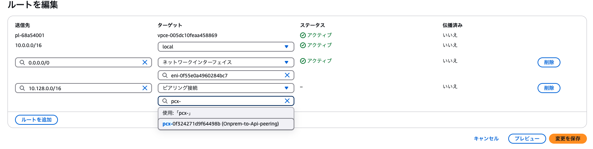
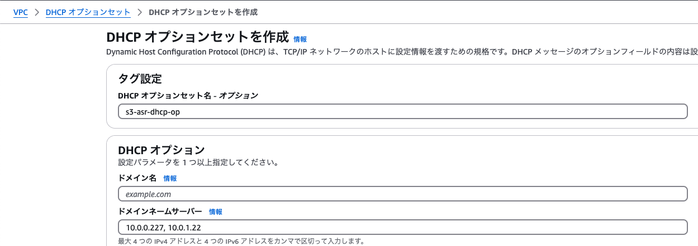
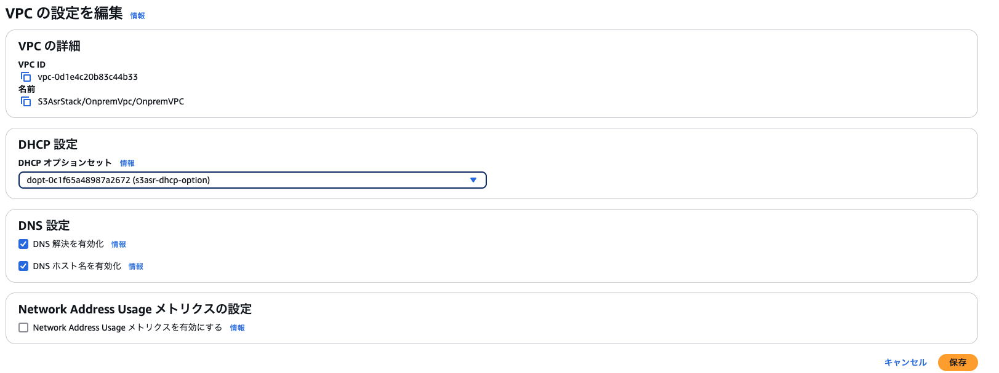

# デバッグモード
以降の手順は、`debugMode: true` の場合の検証方法です。以下のリソースが追加で立ち上がります。

1. OnpremVPC：Private サブネットに Windows Serverインスタンスを含む（1つのAZ）
2. OnpremVPCとAPI VPC間のVPCピアリング接続
3. OnpremVPC内のプライベートサブネットにWindows Serverインスタンス
4. EC2インスタンスコネクトエンドポイント（インスタンスへのRDP接続用）


## 前提
- ローカルコンピュータに [AWS CLI がインストール](https://docs.aws.amazon.com/ja_jp/cli/latest/userguide/getting-started-install.html)されていること
- ローカルコンピュータに Windows Apps などのリモートデスクトップアプリケーションがインストールされていること
- ローカルコンピュータがインターネットに接続していること

## 手順

このモードではデプロイ後に以下を行う必要があります。以下のセットアップをマネジメントコンソール上で行うことにより、検証用 EC2 (Windows Server) から S3 や Transcribe、Dify への VPC を跨いだ通信ができるようになります。

1. Peeringごとのルートテーブルの設定
    - OnpremVPC のルートテーブル 1 つ編集 (s3asr-Onprem-private-subnet-1)
     
    - API VPC のルートテーブル 2 つ編集 (s3asr-Api-private-subnet-{1,2})
    
2. DHCPオプションセットを作成
    - CDKで作成された[Route 53 インバウンドエンドポイントのIP](https://ap-northeast-1.console.aws.amazon.com/route53resolver/home?region=ap-northeast-1#/inbound-endpoints)を確認し、新規のDHCPオプションを作成時、ドメインネームサーバーの部分に登録
    
3. OnpremVPC の DHCP オプションを作成したものに変更
    - 「VPC > VPCの設定を編集」からDHCP設定を変更
    

## Windows Serverインスタンスへの RDP トンネル確立

デプロイ後、以下の手順で Windows Server インスタンスに接続できます：

1. キーペアの取得
    ```bash
    npm run debug:get-pem
    ```

2. Windowsパスワードの取得
    ```bash
    npm run debug:pw
    ```

3. RDPトンネルの確立
    ```bash
    npm run debug:rdp
    ```

## RDPクライアントで接続

Windows Apps などを利用して接続できます。

ローカルのRDPクライアントを起動し、以下の情報で接続します：
- ホスト: `localhost:13389`
- ユーザー名: `Administrator`
- パスワード: 手順2で取得したパスワード

接続後、Microsoft Edge などのブラウザから、ALB のドメイン名へアクセスすることができます。
