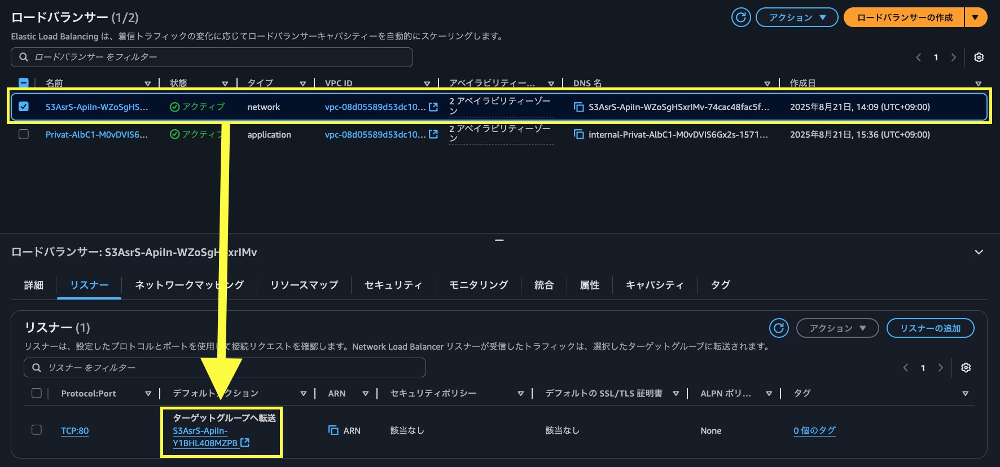

# Internal NLB for Dify 設定手順書

## 概要

この手順書では、Dify ALB の前段に Internal Network Load Balancer（NLB）を配置し、VPC 内からのアクセスを提供する設定方法を説明します。

## 1. CDK デプロイ手順

### 1.1 設定変更

`packages/cdk/bin/app.ts` を編集し、以下の設定を変更します：

```typescript
export const props: EnvironmentProps = {
  // 既存設定...
  useInternalNlb: true, // この行を true に変更
};
```

> [!Note]
> Dify に固定 IP でアクセする場合、追加で [dify-self-hosted-on-aws/bin/cdk.ts](dify-self-hosted-on-aws/bin/cdk.ts) ファイルを以下のようにパラメータを設定します。（[参考](https://note.com/gamo_yoshihiro/n/n38562ebcdccb)）
> ```ts
> export const props: EnvironmentProps = {
>   // 上略。以下を設定。
>   additionalEnvironmentVariables: [
>     // 中略
>     {
>       key: 'APP_API_URL',
>       value: '',
>     },
>     {
>       key: 'CONSOLE_API_URL',
>       value: '',
>     },
>   ],
> };
> ```

### 1.2 デプロイ実行

```bash
# プロジェクトルートで実行
npm run cdk:deploy
```

## 2. NLB のターゲットグループを設定

1. AWS Console で EC2 サービスに移動
2. 左メニューからロードバランサーを選択
3. `S3Asr` とプレフィックスがついた network タイプのロードバランサーを選択
4. リスナータブにあるターゲット部ループを選択

    

### 2.2 ALB の登録

1. Targets タブを選択
2. Register targets ボタンをクリック
3. Target type で Application Load Balancer を選択
4. Dify の ALB を選択
5. Include as pending below をクリック
6. Register pending targets をクリック

### 2.3 ヘルスチェック確認

1. 数分待機後、「Targets」タブを更新
2. Status が「healthy」になることを確認

## 3. 接続テスト

### 3.1 NLB DNS 名での接続確認

```bash
curl -I http://s3asr-Api-internal-nlb-xxxxxxxxx.elb.ap-northeast-1.amazonaws.com
```

## 注意事項

- NLB は Internal（プライベート）なので、VPC 内からのみアクセス可能です
- IP アドレスは動的に割り当てられるため、DNS 名での接続を推奨します
- ALB の登録は Dify デプロイ完了後に手動で行う必要があります
- ヘルスチェックが通るまで数分かかる場合があります
- 最低 2 つの異なる AZ にサブネットが必要です
