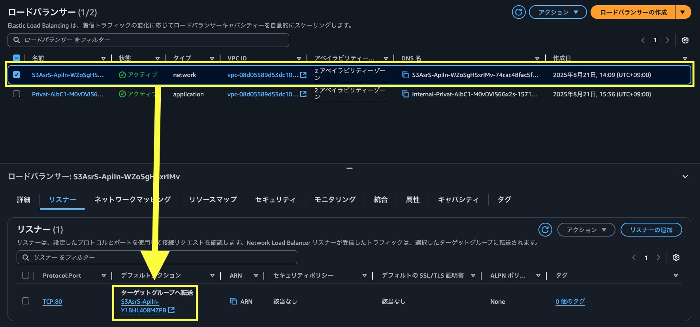

# Internal NLB for Dify 設定手順書

## 概要

この手順書では、Dify ALB の前段に Internal Network Load Balancer（NLB）を配置し、VPC 内からのアクセスを提供する設定方法を説明します。

## 1. CDK デプロイ手順

### 1.1 設定変更

`packages/cdk/bin/app.ts` を編集し、以下の設定を変更します：

```typescript
export const props: EnvironmentProps = {
  // 既存設定...
  useInternalNlb: true, // この行を true に変更
};
```

> [!Note]
> Dify に固定 IP でアクセする場合、追加で [dify-self-hosted-on-aws/bin/cdk.ts](dify-self-hosted-on-aws/bin/cdk.ts) ファイルを以下のようにパラメータを設定します。（[参考](https://legacy-docs.dify.ai/getting-started/install-self-hosted/environments)）
> ```ts
> export const props: EnvironmentProps = {
>   // 上略。以下を設定。
>   additionalEnvironmentVariables: [
>     // 中略
>     {
>       key: 'APP_API_URL',
>       value: '',
>     },
>     {
>       key: 'CONSOLE_API_URL',
>       value: '',
>     },
>   ],
> };
> ```
> 変更した際は、以下のコマンドで Dify on AWS を再デプロイします。
> ```bash
> # dify-self-hosted-on-aws のプロジェクトルートで実行
> npx cdk deploy --all
> ```

### 1.2 デプロイ実行

```bash
# プロジェクトルートで実行
npm run cdk:deploy
```

## 2. NLB のターゲットグループを設定

1. AWS Console で EC2 サービスに移動
2. 左メニューからロードバランサーを選択
3. `S3Asr` とプレフィックスがついた network タイプのロードバランサーを選択
4. リスナータブにあるターゲットグループを選択

    

### 2.2 ALB の登録

1. Targets タブを選択
2. Register targets ボタンをクリック
3. Target type で Application Load Balancer を選択
4. Dify の ALB を選択
5. Include as pending below をクリック
6. Register pending targets をクリック

### 2.3 ヘルスチェック確認

1. 数分待機後、「Targets」タブを更新
2. Status が「healthy」になることを確認

## 3. 接続テスト

### 3.1 NLB DNS 名での接続確認

```bash
curl -I http://s3asr-Api-internal-nlb-xxxxxxxxx.elb.ap-northeast-1.amazonaws.com
```

## 補足事項
閉域網において、DNS サーバーなどがない場合、NLB の固定 IP へアクセスすることが想定される。

Dify では、フロントエンドから API へアクセスする際、[`fetch()` メソッド](https://developer.mozilla.org/ja/docs/Web/API/Fetch_API/Using_Fetch)を利用しており、`fetch('{APIとなるURL}/api/~')` のような絶対パス形式になる。`APIとなるURL` は環境変数の、`APP_API_URL` と `CONSOLE_API_URL` が参照されるが、フロントエンドビルド時に、この両方が `alb.url` となるように指定されている。DNS サーバーがない場合、名前解決ができないためエラーとなってしまう。(https://github.com/aws-samples/dify-self-hosted-on-aws/blob/d285d5db9fe05f6fcd5f514707d1240067aec223/lib/constructs/dify-services/web.ts#L51)

これを回避するため、`APP_API_URL` と `CONSOLE_API_URL` を空文字にすると、fetch メソッドの特性上、`fetch("/api/~")` の呼び出しは相対パスでの API の呼び出しになる。例えば、`10.0.1.140/` で Dify にアクセスしている場合、裏側の API 呼び出しは  `10.0.1.140/api/~` へのアクセスとなり、名前解決の必要がなくなる。

ただし、プラグインの設計上の問題で、この副作用によって正常に動作しなくなるプラグインも存在するため、それらを本格的に運用するような場合は、Route 53 リゾルバーインバウンドエンドポイントを利用することを推奨する。