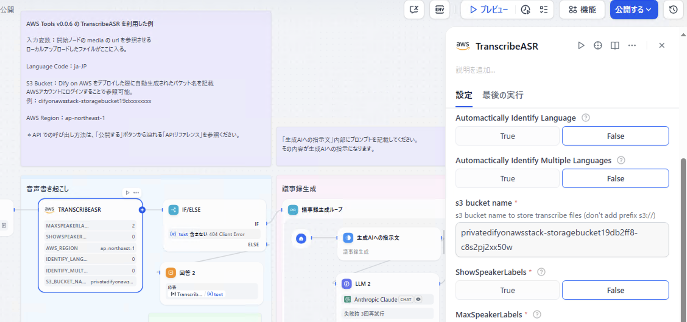

# Amazon Transcribe を利用して音声書き起こしを行う

> [!Caution]
> NLB を利用した固定 IP アクセスを行なっている場合、CONSOLE_API_URL を空文字で相対パスに設定していると、TranscribeASR プラグイン (v0.0.6) の設計上、S3 へのアクセスができずエラーになる。CONSOLE_API_URL　に NLB の IP を指定したフルパスにするとアクセス自体は可能になるが、一つの IP しか登録できないため実質的な単一障害点になってしまう。音声書き起こしを行う場合は、Route 53 リゾルバーインバウンドエンドポイントを利用することを推奨する。

## 前提
本プロジェクトの [packages/bin/app.ts](./packages/cdk/bin/app.ts) のパラメータ設定を最低限以下にしてデプロイされている必要があります。

```ts
export const props: EnvironmentProps = {
  // 以下の二つを true にする必要あり (他省略)
  difySetup: true, // プラグインインストール時に必須
  useTranscribe: true, // Dify から Transcribe を呼び出すのに必要
};
```

> [!Tip]
> difySetup はプラグイン導入後は `false` にして再デプロイすることで、NAT インスタンスの料金を抑えることができます。

## 手順
1. ECS の タスクに紐づく IAM ロールに、Amazon Transcribe を操作できるポリシーを設定
2. Dify で AWS Tools プラグインをインストール
3. サンプルチャットフロー DSL を読み込み

### 1. ポリシーの設定
CloudFormation を開き、DifyonAwsStack のリソースタブから、Cluster の中にある、ECS クラスターをクリック。


開いたページの、「ApiServiceFargateService」という名前が含まれたサービス名をクリック。


サービス概要の右の「タスク定義: 修正」の下の青色リンクをクリック。


概要の「タスクロール」をクリック。


IAM の画面が開くので、「許可を追加」から「ポリシーをアタッチ」をクリック。


「AmazonTranscribeFullAccess」を探して、チェックし、「許可を追加」をクリック。


### 2. Dify プラグインの導入
閉域では、インターネットアクセスができない場合、マーケットプレースが利用できないためプラグインの導入は以下の手順。

インターネットに繋がった端末を利用し、公式マーケットプレースから「AWS Tools」プラグインをインストール。([https://marketplace.dify.ai/plugins/langgenius/aws_tools](https://marketplace.dify.ai/plugins/langgenius/aws_tools)) `langgenius-aws_tools_0.0.6.difypkg` というファイルがダウンロードされる。


閉域の端末に何かしらの手段を用いて `langgenius-aws_tools_0.0.6.difypkg` ファイルをコピーしておいてください。

Dify の プラグイン画面で「プラグインをインストールする」＞「ローカルパッケージファイル」を選択し、「`langgenius-aws_tools_0.0.6.difypkg`」をアップロードします。ポップアップが出てきたら、「インストール」ボタンをクリックして完了です。


### サンプル DSL の読み込み
本リポジトリの [packages/sample/議事録生成ユースケース.yml](https://github.com/yosse95ai/automated-speech-recognition/blob/main/packages/sample/%E8%AD%B0%E4%BA%8B%E9%8C%B2%E7%94%9F%E6%88%90%E3%83%A6%E3%83%BC%E3%82%B9%E3%82%B1%E3%83%BC%E3%82%B9.yml) にアクセスして、raw file をダウンロードします。

Dify のスタジオ画面から、ダウンロードしたチャットフローの DSL をインポートします。


CloudFormation の DifyOnAwsStack のリソースタブから、S3 のバケット名をコピーしておきます。バケット名は、StorageBucket** の物理 ID になります。


Dify に戻り、チャットフローの中の、TRASCRIBEASR ノードの s3 bucket name の内容を先ほどコピーしたバケット名に置き換えます。更新ボタンから更新を公開しておきます。



プレビュー画面を開いて、音声ファイルをアップロードし、適当な文章をチャットボックスに入れて送信します。


## 注意点
### 固定 IP で Dify on AWS を利用している
Dify に固定 IP でアクセスしている (つまり Web のコンテナ環境変数 CONSOLE_API_URL の値が空文字で、API へ相対パスでアクセスしている) 場合、AWS Tools の TranscribeASR ノードはうまく動作しないため、注意が必要。

CONSOLE_API_URL に固定の IP を記載することで、回避は可能であるが、IP は一つしか登録できないため、単一障害点になる可能性が高い。本格的に運用する場合は、Route 53 リゾルバーインバウンドエンドポイントを利用することを推奨する。

### S3 に保存されるメディアファイル
TranscribeASR を利用すると、通常 Dify on AWS がファイルアップロード時に利用している、uploads/ プレフィックスと transcribe-files/ プレフィックスの両方にメディアファイルが保存されることとなる。uploads/ の方は基本的に Dify のログようとして利用されている。transcribe-files/ の方は文字起こしのために利用されているため、こちらを S3 ライフサイクルルールを用いて、1日で削除あsれるようなライフサイクルにするとコストを節約することができる。

ログにおいて、アップロードしたファイルのプレビューなどが完全に必要ないような場合、uploads/ の方にもライフサイクルルールを適用してあげることで、さらに S3 の保存コストの削減を行えるようになるが、ログ画面での画像や PDF の参照はできなくなる。